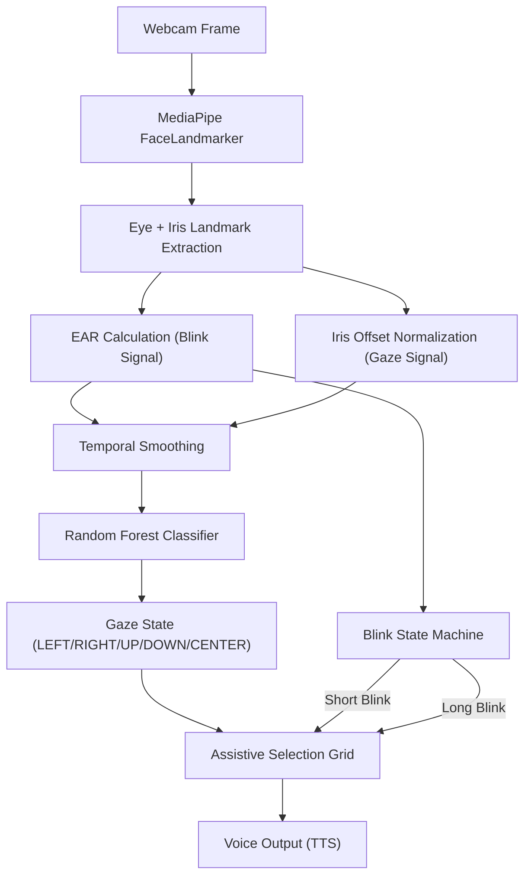

# 👁️ NeuroGaze — Real-Time Eye Movement & Blink Analyzer

### *OpenCV + MediaPipe + Scikit-learn*

<p align="center">
  
  
  
  
</p>

<p align="center">
  <b>A real-time computer vision pipeline that tracks facial landmarks, eyes, and iris position to classify gaze direction and blinks — built for assistive communication and neurological assessment use cases.</b>
</p>

---

## ✨ Overview

This project turns a standard webcam feed into a **gaze + blink recognition system**.

It uses MediaPipe's FaceLandmarker to extract eye and iris landmarks per frame, converts them into a compact feature vector (eye-aspect-ratio + normalized iris offset), and classifies the current eye state — **LEFT / RIGHT / UP / DOWN / CENTER** — using a trained Random Forest model, on top of an independent Eye Aspect Ratio (EAR)-based blink detector.

The end result is demonstrated as a hands-free **4-option communication grid (YES / NO / HELP / WATER)** that a user can navigate with their eyes and confirm with a blink — with optional voice output.

---

## 🚀 Demo Features

* 🎯 Real-time iris and eyelid tracking from a live webcam feed
* 🧠 ML-based gaze classification (Logistic Regression + Random Forest, compared)
* 👁️ Independent EAR-based blink detection (short blink vs. long blink)
* 🧑‍🦽 Assistive 2×2 selection grid (YES / NO / HELP / WATER), navigated by gaze and confirmed by blink
* 🔊 Optional text-to-speech confirmation of the selected option (Windows SAPI)
* 🎚️ Per-user calibration step to zero out individual eye geometry differences
* 📊 Built-in evaluation suite: accuracy, confusion matrices, and threshold-sensitivity sweeps

---

## 🏗️ System Architecture



---

## 🧠 Tech Stack

| Component          | Technology                                    |
| ------------------- | ---------------------------------------------- |
| Face/Eye Landmarks  | MediaPipe FaceLandmarker (Tasks API)           |
| Video Capture       | OpenCV                                         |
| Feature Engineering | EAR (Eye Aspect Ratio) + normalized iris offset|
| Classification      | Scikit-learn (Logistic Regression, Random Forest) |
| Evaluation          | Matplotlib, Seaborn (confusion matrix, threshold sweeps) |
| Voice Output        | Windows SAPI via PowerShell (optional)         |
| Language            | Python                                         |

---

## ⚙️ Installation

### 1. Clone the Repository

```bash
git clone https://github.com/Anush1214/eye_movement_project.git
cd eye_movement_project/cv
```

### 2. Install Dependencies

```bash
pip install opencv-python mediapipe numpy pandas scikit-learn joblib matplotlib seaborn
```

### 3. Model Assets

This repo already includes a pretrained model and the MediaPipe landmark model, so you can run gaze tracking immediately without retraining:

* `face_landmarker.task` — MediaPipe FaceLandmarker model
* `gaze_blink_rf_model.pkl` — pretrained Random Forest gaze classifier
* `feature_scaler.pkl` — fitted `StandardScaler` used at inference time

---

## ▶️ Running the Project

| Script | Purpose |
| ------ | ------- |
| `dataset.py` | Collects labeled training samples from your webcam (press `L`/`R`/`U`/`D`/`C` to label a frame, `Q` to quit) |
| `ml_train.py` | Trains Logistic Regression and Random Forest models on the collected dataset, saves the best model + scaler |
| `evaluate.py` | Runs full accuracy evaluation, cross-validation, confusion matrices, and threshold-sensitivity sweeps (saved to `eval_output/`) |
| `blink_detection.py` | Standalone real-time blink counter demo |
| `face_mesh_test.py` | Minimal sanity-check script to visualize raw eye landmarks |
| `gaze_tracking.py` | Full assistive-communication demo: gaze-controlled selection grid + blink confirmation + voice output |

```bash
python gaze_tracking.py
```

Press `ESC` in the OpenCV window to quit any script.

> ⚠️ **Note:** the voice output in `gaze_tracking.py` calls Windows PowerShell's SAPI voice engine directly, so text-to-speech only works on Windows. The gaze/blink tracking itself is cross-platform.

---

## 📊 Results

Evaluated on the included dataset — **317 labeled samples** across 5 gaze classes (LEFT, RIGHT, UP, DOWN, CENTER):

| Metric | Random Forest | Logistic Regression |
| ------ | -------------- | -------------------- |
| Test Accuracy (20% holdout) | **98.4%** | 98.4% |
| 5-Fold Cross-Validation | **98.4% ± 1.7%** | — |

Full per-class precision/recall, confusion matrices, and blink/gaze threshold-sensitivity sweeps are generated by `evaluate.py` and saved to `eval_output/` (`confusion_matrix.png`, `blink_threshold_sweep.png`, `gaze_threshold_sweep.png`).

---

## 🔍 Key Design Highlights

* **Corner-normalized iris offset** — gaze is computed as the iris center's offset from the eye-corner midpoint, normalized by eye width, rather than raw pixel position. This makes the signal far more robust to head movement and distance from the camera than naive pixel tracking.
* **Per-user calibration** — a short "look center" calibration phase at startup zeroes out individual differences in eye shape and resting EAR, before any classification happens.
* **Temporal smoothing + hysteresis** — gaze and EAR signals are exponentially smoothed frame-to-frame, and UP detection uses a lower re-entry threshold once already active, reducing flicker between adjacent states.
* **Stable-frame confirmation** — a predicted gaze direction must hold for several consecutive frames before it's treated as a confirmed selection, avoiding accidental grid jumps from a single noisy frame.
* **Independent blink pipeline** — blink detection runs on EAR thresholding rather than the ML classifier, and distinguishes short blinks (selection confirm) from long blinks, so eyelid state and gaze direction are decoupled.

---

## 📁 Project Structure

```
cv/
├── dataset.py               # Webcam data collection + labeling tool
├── ml_train.py               # Model training (Logistic Regression + Random Forest)
├── evaluate.py                # Accuracy, CV, confusion matrix, threshold sweeps
├── blink_detection.py         # Standalone blink counter demo
├── face_mesh_test.py          # Landmark visualization sanity check
├── gaze_tracking.py           # Full assistive communication demo
├── face_landmarker.task       # MediaPipe face landmark model
├── gaze_blink_rf_model.pkl    # Pretrained Random Forest classifier
├── feature_scaler.pkl         # Fitted feature scaler
├── eye_movement_dataset.csv   # Labeled training dataset (317 samples)
└── eval_output/                # Generated evaluation plots
```

---

## 🔮 Future Enhancements

* 📱 Cross-platform text-to-speech (replace Windows SAPI dependency)
* 🎯 Continuous cursor/pointer control instead of discrete grid navigation
* 🧠 Expand assistive grid beyond 4 options with nested menus
* 📈 Larger, multi-subject dataset for improved generalization across face shapes
* 🌐 Web-based deployment (browser-based MediaPipe + WASM)

---

## 👤 Author

**Anush Rao**
AIML Engineer | AI Systems Builder

---

<p align="center">
  Built with ❤️ using OpenCV, MediaPipe, and Scikit-learn
</p>
